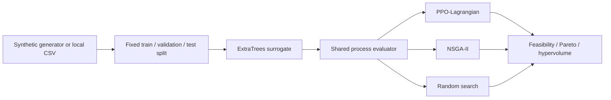

# Electrowinning RL

[](https://github.com/s1encisi/electrowinning-rl/actions/workflows/ci.yml)
[](https://www.python.org/)
[](LICENSE)

**Surrogate-assisted constrained reinforcement learning for copper electrowinning setpoint optimization.**

Train a process surrogate, optimize competing objectives with PPO-Lagrangian and
NSGA-II, and inspect feasibility and Pareto metrics through one command-line interface.
The public workflow generates **synthetic data** from an explicit response function.
It requires no private dataset, pretrained model, Excel template, GPU, or cloud API.

[中文项目介绍与简历要点](docs/resume.zh-CN.md) · [Algorithm details](docs/architecture.md) ·
[Data contract](docs/data.md) · [Measured results](docs/benchmark.md)

## What this project demonstrates

- **ML pipeline:** multi-output ExtraTrees, train-only imputation, fixed 60/20/20
  train/validation/test split, validation-based model selection and untouched holdout.
- **Constrained RL:** preference-conditioned PPO, tanh-squashed continuous actions,
  reward and five cost-value heads, GAE and independent projected dual updates.
- **Industrial optimization:** three operating modes, four objectives and five
  constraints, with one vectorized process evaluator shared by every method.
- **Engineering:** installable Python package, validated JSON configurations,
  deterministic seeds, checkpoint integrity checks, CLI, structured results and CI.



## Install

Use **Python 3.11**. These commands work in PowerShell without changing its execution policy:

```powershell
git clone https://github.com/s1encisi/electrowinning-rl.git
cd electrowinning-rl
python -m venv .venv
.venv/Scripts/python.exe -m pip install torch==2.12.1 --no-deps --index-url https://download.pytorch.org/whl/cpu
.venv/Scripts/python.exe -m pip install -r requirements.txt
.venv/Scripts/python.exe -m pip install -e . --no-deps
```

Linux/macOS: replace `.venv/Scripts/python.exe` with `.venv/bin/python` in these
commands. The CPU wheel is the default validation target. For a CUDA installation,
use the [official PyTorch selector](https://pytorch.org/get-started/locally/) and set
`"device": "cuda"`; the trainer logs a CPU fallback when CUDA is unavailable.
The benchmark results below were measured on CPU.

## Run the complete workflow

```powershell
.venv/Scripts/python.exe -m electrowinning_rl demo --config configs/demo.json --output runs/demo
```

This generates 2,400 synthetic rows, fits a surrogate, runs NSGA-II and random search,
trains PPO for 4,096 transitions, evaluates the policy and writes results. No extra
download is performed during a run. `--condition 1`, `2`, or `3` selects Unit A,
Unit B, or the serial A+B mode.

For a small installation check:

```powershell
.venv/Scripts/python.exe -m electrowinning_rl demo --config configs/smoke.json --condition 3 --output runs/smoke
```

Each output directory must be new or empty; existing runs are never overwritten.
Installed packages can be invoked from any working directory; relative paths resolve
against that directory. The optional `ewrl` console command exposes the same CLI.

```text
runs/demo/
  config.json               # Effective configuration
  synthetic_data.csv        # Clearly generated demonstration data
  surrogate.joblib          # Fitted model and feature-order contract
  surrogate_metrics.json    # Split indices, selection score and holdout metrics
  policy.pt                 # Policy, value heads, dual variables and model digest
  training.csv              # Reward, feasibility, KL, loss, costs and multipliers
  *_candidates.csv          # Decisions, outputs, objectives and signed constraints
  *_pareto.csv              # Feasible nondominated objective vectors
  summary.csv               # Per-method comparison
  metrics.json              # Configuration, versions, hashes and metrics
  run.log
```

## Train, optimize and reload separately

```powershell
# Train a surrogate from generated data, or add --data data/private/measurements.csv.
.venv/Scripts/python.exe -m electrowinning_rl train-surrogate --condition 1 --output runs/model

# Train a policy against the saved surrogate.
.venv/Scripts/python.exe -m electrowinning_rl train --model runs/model/surrogate.joblib --condition 1 --config configs/demo.json --output runs/policy

# Run the evolutionary baseline with the same process configuration.
.venv/Scripts/python.exe -m electrowinning_rl baseline --model runs/model/surrogate.joblib --condition 1 --output runs/nsga2

# Reload policy and verify its surrogate SHA-256 before evaluation.
.venv/Scripts/python.exe -m electrowinning_rl evaluate --model runs/model/surrogate.joblib --policy runs/policy/policy.pt --output runs/evaluation
```

Use `--help` for all commands. JSON configuration keys are defined in
[`config.py`](src/electrowinning_rl/config.py); unknown keys and inconsistent rollout
budgets fail explicitly. A run records its resolved configuration. Only load trusted
`.joblib` models, because that format uses pickle internally.

## Algorithm and process contract

All methods minimize `[Cu_out, -As_out, energy_kwh, -profit]` over the same decision
domain. Residual arsenic has a **lower** bound in this scenario: maintaining arsenic
in solution is modeled as a way to limit co-deposition, not as wastewater removal.
Constraints cover copper concentration, arsenic concentration, current density,
cell voltage and the copper/arsenic ratio. Economic coefficients are fixed scenario
inputs with documented units, not current commodity prices.

The policy observes normalized setpoints, four preference weights and time remaining.
Bounded actions adjust every decision coordinate. The reward is the negative weighted
sum of scaled objectives. Five normalized positive violations drive independent
Lagrange multipliers; reward and cost advantages are combined in the clipped PPO
objective. A finite search horizon ends the task and stops GAE bootstrapping.

This is sequential **setpoint search over a surrogate**, not learned plant dynamics.
Constraint penalties do not guarantee hard safety; every reported Pareto set is
filtered using the shared constraints. See [the mathematical contract](docs/architecture.md).

## Reproduce the benchmark

```powershell
.venv/Scripts/python.exe -m electrowinning_rl benchmark --config configs/benchmark.json --conditions 1 2 3 --seeds 11 23 42 --output runs/benchmark
```

The release benchmark contains nine complete runs: 4,000 synthetic rows per run,
16,384 PPO training transitions, 64 evaluation episodes of 24 steps, and NSGA-II
with population 64 for 24 generations. Random search receives the actual NSGA-II
evaluation count. The full run took about **244 seconds** on the development machine;
installation time is excluded and timings depend on hardware.

**Measured holdout R² (mean across the three seeds):**

| Mode | Copper | Arsenic | Voltage |
|---|---:|---:|---:|
| Unit A | 0.9756 | 0.9883 | 0.9981 |
| Unit B | 0.9756 | 0.9883 | 0.9981 |
| Serial A+B | 0.9067 | 0.9510 | 0.9870 |

**Measured normalized feasible hypervolume (mean ± sample standard deviation):**

| Mode | Random search | PPO-Lagrangian | NSGA-II |
|---|---:|---:|---:|
| Unit A | 5.9306 ± 0.0178 | 6.0806 ± 0.0633 | 6.3101 ± 0.0121 |
| Unit B | 5.9311 ± 0.0118 | 6.0301 ± 0.1165 | 6.2931 ± 0.0450 |
| Serial A+B | 4.6975 ± 0.0905 | 4.1607 ± 0.1931 | 5.0853 ± 0.0959 |

NSGA-II is the stronger optimizer in this short-run example. PPO exceeds random
search in the first two modes and underperforms it in the serial mode. Training/search
budgets and Pareto set sizes differ, so this is a workflow benchmark, not a claim of
equal-budget algorithm superiority. All numbers concern synthetic data, not plant
savings or industrial validation. The generator and policy both vary with the seed.

[Full protocol, feasibility results and per-run evidence](docs/benchmark.md).

## Project layout

```text
electrowinning-rl/
├── src/electrowinning_rl/
│   ├── cli.py              # Unified workflows
│   ├── config.py           # Validated process and training parameters
│   ├── process.py          # Shared units, objectives, constraints and demo oracle
│   ├── surrogate.py        # Leakage-controlled ExtraTrees pipeline
│   ├── env.py              # Gymnasium API and batched transitions
│   ├── ppo.py              # Actor-critic, GAE, dual updates and checkpoints
│   ├── baselines.py        # NSGA-II and random search
│   └── evaluation.py       # Feasible Pareto sets and metrics
├── configs/                # Smoke, demo and benchmark budgets
├── tests/                  # Numerical contracts and complete workflow tests
├── docs/                   # Architecture, data, benchmarks and resume notes
├── scripts/                # PowerShell and Bash entry helpers
├── .github/workflows/      # Windows/Linux test matrix
├── pyproject.toml
├── requirements.txt
└── LICENSE
```

## Development checks

```powershell
.venv/Scripts/python.exe -m pip install -r requirements-dev.txt
.venv/Scripts/python.exe -m pytest -q
.venv/Scripts/python.exe -m ruff check src tests
```

The tests cover independent formula calculations, constraint signs, all three Gymnasium
contracts, terminal-aware GAE, transformed action likelihoods, holdout isolation,
train-only imputation, duplicate handling and exact checkpoint reload behavior.

MIT licensed. Generated datasets and run artifacts are excluded from version control;
only compact, auditable benchmark summaries are included.
