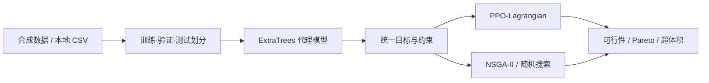

# Electrowinning RL

**面向铜电积工况选择的代理模型与约束强化学习实验平台。** 将数据生成、代理建模、PPO-Lagrangian 搜索、NSGA-II 对照和可行解评估连接成可复现的命令行流程。

项目使用明确标注的合成数据，可以在 CPU 上完成演示，无需私有工厂数据、云端 API 或预训练模型。它展示的是代理模型上的设定值搜索，结果不代表实际产线收益。

## 核心实现

- **一致的优化问题：** 三种工况共享决策边界、四个目标和五项约束，强化学习、NSGA-II 与随机搜索调用同一个过程评估器。
- **可审查的机器学习流程：** 多输出 ExtraTrees、训练集内缺失值填补、固定训练/验证/测试划分，通过验证集选择模型，保留独立测试集。
- **约束强化学习：** 偏好条件化策略、tanh 有界动作、GAE、奖励与五个约束价值头，以及分别更新的拉格朗日乘子。
- **实验可复现：** 配置校验、固定种子、结构化训练日志、可行 Pareto 集和超体积指标；重载策略时检查代理模型摘要。


```mermaid
flowchart LR
  D[合成数据 / 本地 CSV] --> S[训练·验证·测试划分]
  S --> M[ExtraTrees 代理模型]
  M --> P[统一目标与约束]
  P --> R[PPO-Lagrangian]
  P --> N[NSGA-II / 随机搜索]
  R --> E[可行性 / Pareto / 超体积]
  N --> E
```

技术栈：Python、PyTorch、scikit-learn、Gymnasium、pymoo、pytest。

## 快速开始

使用 Python 3.11 或更高版本，在虚拟环境中安装依赖：

```bash
git clone https://github.com/s1encisi/electrowinning-rl.git
cd electrowinning-rl
python -m venv .venv
# 先激活虚拟环境；Windows PowerShell 也可直接使用 .venv/Scripts/python.exe
python -m pip install -e ".[dev]"
python -m electrowinning_rl demo --config configs/smoke.json --condition 3 --output runs/smoke
```

`smoke.json` 用于安装检查；`demo.json` 提供更完整的训练预算。输出目录必须不存在或为空，防止覆盖已有实验。一次运行会生成代理模型、策略、训练日志、候选解、Pareto 集、`summary.csv` 和 `metrics.json`。

```bash
python -m electrowinning_rl demo --config configs/demo.json --output runs/demo
python -m electrowinning_rl --help
python -m pytest -q
python -m ruff check src tests
```

如只希望安装 CPU 版 PyTorch，可先按 PyTorch 官方安装入口选择对应 wheel，再安装本项目。依赖版本范围见 [pyproject.toml](pyproject.toml)，既有实验的固定依赖见 [requirements.txt](requirements.txt)。

## 验证与结果

现有测试覆盖三种工况的端到端流程、检查点重载、公式与约束符号、动作概率、GAE、数据划分和训练集预处理。2026-09-30 在本地环境执行的 22 项测试全部通过。

仓库保留了三种工况、三个种子的合成数据基准及原始汇总，参见 [基准协议与结果](docs/benchmark.md)。该短预算实验中 NSGA-II 的优化结果较强；各方法的预算及解集规模不同，不据此声称等预算算法优势。

## 深入阅读

- [算法与工程约定](docs/architecture.md)：目标、单位、约束、PPO 更新和实验协议。
- [数据契约](docs/data.md)：输入列、数据顺序和本地 CSV 的使用方式。
- [核心实现](src/electrowinning_rl/)：`process.py` 定义问题，`surrogate.py` 建模，`ppo.py` 搜索，`evaluation.py` 评估。

约束惩罚不构成硬安全保证，输出解集仍需通过统一约束筛选。模型检查点只应来自可信来源。

采用 [MIT 许可证](LICENSE)。
